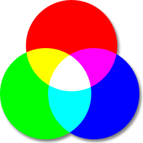
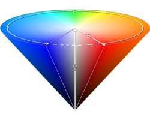
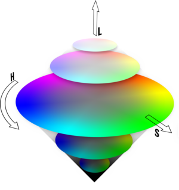
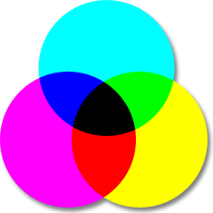
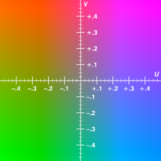

## RGB (Red Green Blue)
The RGB (Red, Green, Blue) color model is the most known, and the most used every day. It defines a color space in terms of three components:

- Red, which ranges from 0-255
- Green, which ranges from 0-255
- Blue, which ranges from 0-255

The RGB color model is an additive one. In other words, Red, Green and Blue values (known as the three primary colors) are combined to reproduce other colors.
For example, the color "Red" can be represented as [R=255, G=0, B=0], "Violet" as [R=238, G=130, B=238], etc.

Its common graphic representation is the following image:

## HSB color space
The HSB (Hue, Saturation, B rightness) color model defines a color space in terms of three constituent components:

- Hue : the color type (such as red, blue, or yellow).
    - Ranges from 0 to 360° in most applications. (each value corresponds to one color : 0 is red, 45 is a shade of orange and 55 is a shade of yellow).
- Saturation : the intensity of the color.
    - Ranges from 0 to 100% (0 means no color, that is a shade of grey between black and white; 100 means intense color).
    - Also sometimes called the "purity" by analogy to the colorimetric quantities excitation purity.
- Brightness (or Value) : the brightness of the color.
    - Ranges from 0 to 100% (0 is always black; depending on the saturation, 100 may be white or a more or less saturated color).

Its common graphic representation is the following image:

The HSB model is also known as HSV (Hue, Saturation, Value) model. The HSV model was created in 1978 by Alvy Ray Smith . It is a nonlinear transformation of the RGB color space. In other words, color is not defined as a simple combination (addition/substraction) of primary colors but as a mathematical transformation.

Note: HSV and HSB are the same, but HSL is different.

All this said, a HSB structure can be :

## HSL color space
The HSL color space, also called HLS or HSI , stands for:

- Hue : the color type (such as red, blue, or yellow).
    - Ranges from 0 to 360° in most applications (each value corresponds to one color : 0 is red, 45 is a shade of orange and 55 is a shade of yellow).
- Saturation : variation of the color depending on the lightness.
    - Ranges from 0 to 100% (from the center of the black&white axis).
- Lightness (also Luminance or Luminosity or Intensity).
    - Ranges from 0 to 100% (from black to white).

Its common graphic representation is the following image:

HSL is similar to HSB. The main difference is that HSL is symmetrical to lightness and darkness. This means that:

In HSL, the Saturation component always goes from fully saturated color to the equivalent gray (in HSB, with B at maximum, it goes from saturated color to white).
In HSL, the Lightness always spans the entire range from black through the chosen hue to white (in HSB, the B component only goes half that way, from black to the chosen hue).
For my part, HSL offers a more accurate (even if it's not absolute) color approximation than HSB.

## CMYK color space
The CMYK color space, also known as CMJN, stands for:

- Cyan.
    - Ranges from 0 to 100% in most applications.
- Magenta.
    - Ranges from 0 to 100% in most applications.
- Yellow.
    - Ranges from 0 to 100% in most applications.
- blacK.
    - Ranges from 0 to 100% in most applications.
It is a subtractive color model used in color printing. CMYK works on an optical illusion that is based on light absorption.
The principle is to superimpose three images; one for cyan, one for magenta and one for yellow; which will reproduce colors.

Its common graphic representation is the following image:

Like the RGB color model, CMYK is a combination of primary colors (cyan, magenta, yellow and black). It is, probably, the only thing they have in common.
CMYK suffers from a lack of color shades that causes holes in the color spectrum it can reproduce. That's why there are often differencies when someone convert a color between CMYK to RGB.

Why using this model? Why black is used? you can tell me... Well it's only for practical purpose. Wikipedia said:

- To improve print quality and reduce moiré patterns,
- Text is typically printed in black and includes fine detail (such as serifs); so to reproduce text using three inks would require an extremely precise alignment for each three components image.
- A combination of cyan, magenta, and yellow pigments don't produce (or rarely) pure black.
- Mixing all three color inks together to make black can make the paper rather wet when not using dry toner, which is an issue in high speed printing where the paper must dry extremely rapidly to avoid marking the next sheet, and poor quality paper such as newsprint may break if it becomes too wet.
- Using a unit amount of black ink rather than three unit amounts of the process color inks can lead to significant cost savings (black ink is often cheaper).

## YUV color space
The YUV model defines a color space in terms of one luma and two chrominance components and is similar to YPbPr and YCbCr. The YUV color model is used in the PAL, NTSC, and SECAM composite color video standards.
YUV models human perception of color more closely than the standard RGB model used in computer graphics hardware.

The YUV color space stands for:

- Y, the luma component, or the brightness.
    - Ranges from 0 to 100% in most applications.
- U and V are the chrominance components (blue-luminance and red-luminance differences components).
    - Expressed as factors depending on the YUV version you want to use.

A graphic representation is the following image:

